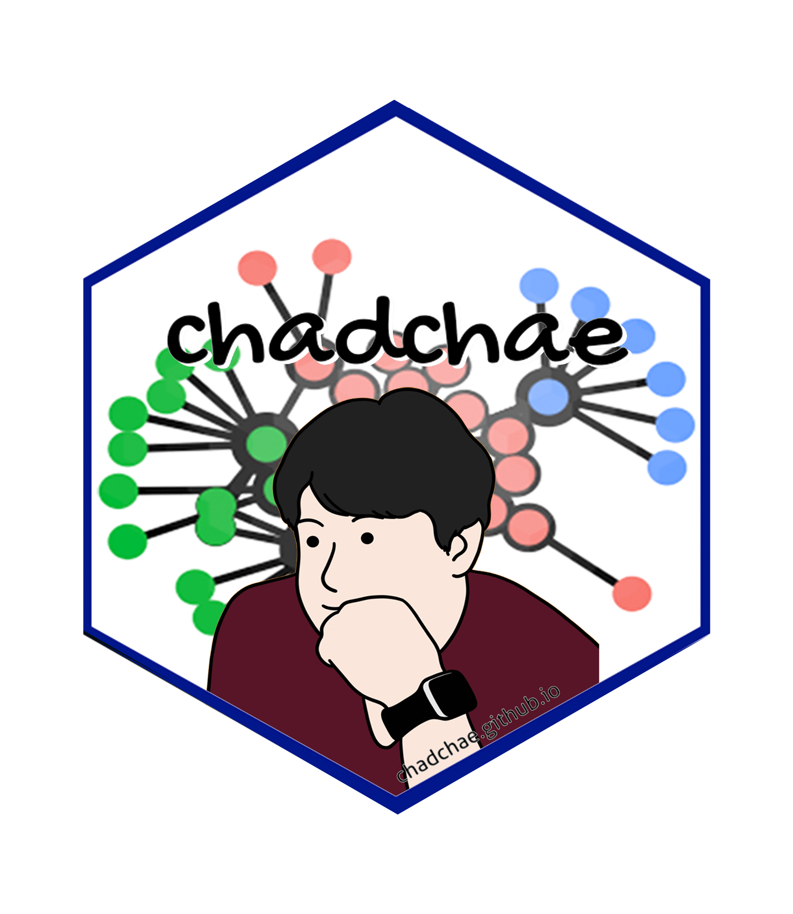

# A bibliometric analysis of tourists’ experience and happiness in tourism (2000-2024) {.unnumbered}

## Abstract

> This study presents a bibliometric analysis of research on tourists’ experiences and happiness in tourism from 1992 to 2025. Using co-citation analysis, keyword co-occurrence, and thematic mapping, this study identifies key research themes, influential works, and emerging trends. The findings reveal four major thematic clusters: Health, Satisfaction, Perceptions, and Quality of Life, with satisfaction playing a central role in linking various subfields of tourism research. The analysis highlights a growing emphasis on well-being, digital tourism, and sustainability, along with increasing interdisciplinary and international collaborations. Future research should explore cultural variations in happiness, the influence of travel on mental resilience, and the role of digital innovations in shaping tourism experiences. This study provides a comprehensive mapping of the intellectual landscape of tourism and well-being, offering valuable insights for researchers, policymakers, and industry practitioners.

## Planning

### Schedule
- 2025/03/01 Submit

### Progress
- 1st round revision

## Authorship and Authors

### Author Contribution

- Supervision: Jangwook Kwon
- Project administration:
  - Jangwook Kwon
- Conceptualization:
  - Jangwook Kwon
-  Data accusation:
  - Chungil (Chad) Chae
-  Data curation:
  - Chungil (Chad) Chae
-  Formal analysis:
  - Chungil (Chad) Chae
- Investigation:
  - Jangwook Kwon, Chungil (Chad) Chae
- Methodology:
  - Chungil (Chad) Chae
- Resources:
  - Jangwook Kwon, Chungil (Chad) Chae
- Validation:
  - Jangwook Kwon, Chungil (Chad) Chae
- Visualization:
  - Jangwook Kwon, Chungil (Chad) Chae
- Writing – original draft:
  - Jangwook Kwon, Chungil (Chad) Chae
- Writing – review & editing:
  - Jangwook Kwon, Chungil (Chad) Chae

### Authors

#### Jangwook Kwon

:::: {.columns}

::: {.column width="70%"}
- jwkwon\@dongseo.ac.kr
- orcid: [000-0000-0000-0000](https://orcid.org/)
- [Google Scholar](https://scholar.google.com/citations?user=gGPMv1IAAAAJ&hl=ko&oi=sra)

:::

::: {.column width="30%"}

:::

::::

> Jangwook Kwon is a distinguished academic and professional in the field of tourism, with expertise spanning tourism studies, brand marketing, and MICE (Meetings, Incentives, Conferences, and Exhibitions). He holds a Ph.D. in Tourism from Hanyang University, an MBA from Keio University, and a degree in Public Administration from Hankuk University of Foreign Studies. Dr. Kwon has a diverse and impactful career, having previously worked at the Korea Tourism Organization in various roles, including in the Brand Marketing Team, Tokyo Office, and Human Resources Development Team. He is currently serving as a board member of the MICE Tourism Association, a consultant for the Korea Tourism Organization’s Tourism Plus TIPS program, and holds several advisory roles in local tourism organizations, including the Busan Metropolitan City Tourism Development Committee and the Ulsan Tourism Foundation. His research interests focus on areas such as the impacts of tourism on local economies, the role of technology in tourism, and consumer behavior within the tourism industry. Dr. Kwon has published numerous articles in reputable journals and has contributed to various research projects aimed at advancing tourism policy and strategy. He has also been recognized with several prestigious awards, including the Minister of Culture, Sports and Tourism Citation and Best Paper awards. In addition to his academic and professional roles, Dr. Kwon is a published author, having written books such as The Hidden Secrets of Travel: Serendipity and Uncertainty and Practical Strategies for Using Tourism Data, both of which have been widely recognized in the tourism community.

#### Hoon Lee

:::: {.columns}

::: {.column width="70%"}
- kenpoet\@naver.com
- orcid: [000-0000-0000-0000](https://orcid.org/)
- Devision of Tourism, Hanyang University, Seoul, South Korea
- [Google Scholar]()

:::

::: {.column width="30%"}

:::

::::

> Hoon Lee is a  professor at Hanyang university in Seoul, Korea. He is the head of the Hanyang Tourism Research Institute, and has advised on tourism policy of Seoul and Korea national tourism organization(KNTO). His current research interests are happiness in tourism, fair & sustainable tourism, and tourism content development.

#### Chungil Chae, Ph.D., M.S. Corresponding Author

:::: {.columns}

::: {.column width="70%"}
- chadchae\@gmail.com
- orcid: [000-0002-7364-1525](https://orcid.org/0000-0002-7364-1525)
- [Google Scholar](https://scholar.google.com/citations?user=c4lRBrkAAAAJ&hl=en)
- @chadchae

:::

::: {.column width="30%"}

:::

::::

> Chungil Chae (Chad), Ph.D., is an Assistant Professor in Business Analytics at Wenzhou-Kean University, specializing in data analytics, human resource development, and knowledge-sharing in multinational organizations. With a Ph.D. from Pennsylvania State University, his research integrates business intelligence, workforce education, and computational social science. Dr. Chae has an extensive publication record in top-tier journals and has received multiple academic awards, including the Outstanding Paper in the Emerald Literati Awards. He has held positions as a post-doctoral scholar at Penn State and has contributed to various funded research projects in cognitive science and business analytics. His expertise extends to teaching business analytics, data mining, and management courses while actively engaging in curriculum development and academic service.

### Acknowledgement
- The authors sincerely appreciate the contributions of the following individuals to this manuscript. Danny, Diane, Jason, and Joanna assisted with proofreading, while Owen and Vilchega contributed to data collection. Bruce provided valuable support in the literature investigation. Their efforts and dedication have enhanced the quality and integrity of this work, and we extend our heartfelt gratitude for their assistance.

## Declearation

### IRB
- Data collected from public database and not involved with any critical human subject, therefore, not a subject of IRB review.

### Conflict of Interest
- No conflicts of intests to disclose.

### Funding
- No Specific funding was received for this reserach.

### AI
- Generative AI has used for proof reading and revision stage for enhancing quality and clearity of language.

